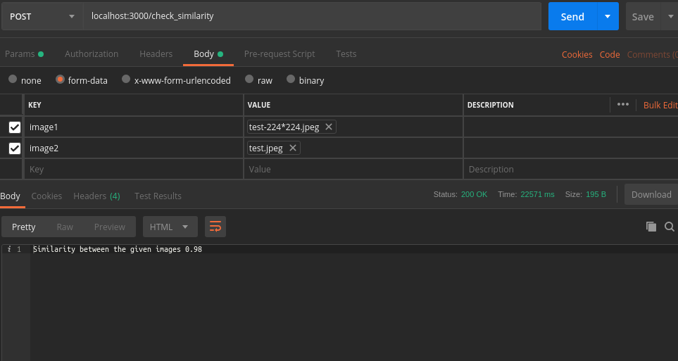

# image_similarity

This is an example of finding similar images using deep-leaning models.

# How ?
I used two methods for solving this. 
## Siamese networks
A siamese neural network is an artificial neural network that use the same
weights while working in tandem on two different input vectors to compute 
comparable output vectors.
I used a modified fashion mnist dataset for training. 
What i did basically was to create a feature extractor using convolution layers and used it's output as the input of the other network which will used for identifying the similarity.I modified fashion mnist in a way that i take two images and put them together and if it was from the same class then the similarity will be 1 else 0. 
Basically what is does is ramdomly initilaizes a feature extractor network and uses it's ouput and train the similarity network using as inputs
## Cosine Similarity
Here i used a simple classifier and used it's last convolution and flattend.
Which will give us a vector and i used cosine similarity to check whether
the vectors produced by our model are equal or not.There are two models.
One is a custom classifer made of custom architecture and trained and tested on
fashion-mnist dataset the other one is a pretrained vgg on imagenet which gives 
us a lot of classes for checking the similarity out of the box.In vgg i have created
a small flask server which will gives us the similarity model as an api

# How to run ?

### For try out the first method 
`python3 siamese.py`
### For try out the vgg model just run  
`python3 pretrained_model.py`  
Which will give a server running at port 3000 the request format is shown below  

 
### For training  the fashion mnist model  
`python3 trainer.py --num_epochs=100` or `python3 trainer.py` 
The default epoch is set to 10  
### For testing it with the already provided model  
`python3 infer.py`
